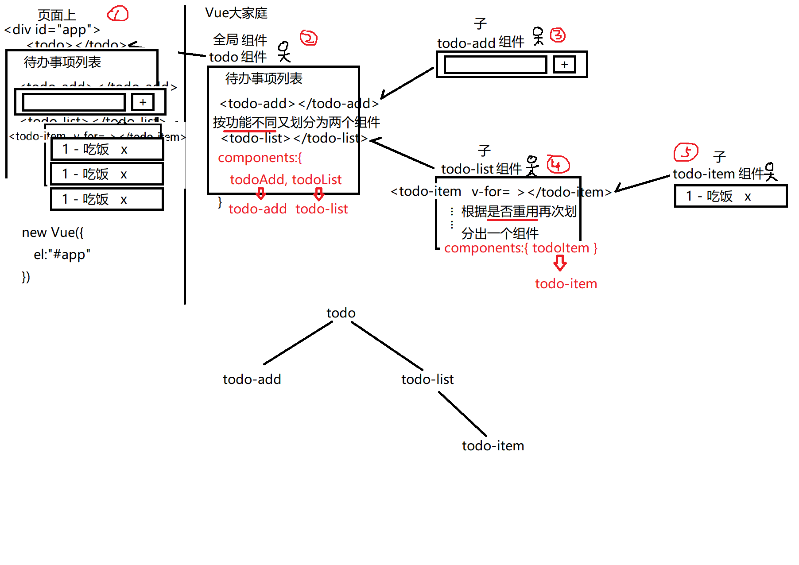

正课:
1. 组件
2. 组件化开发
3. SPA

### 一. 组件:
1. 什么是:页面中拥有专属的HTML、CSS、js和数据的可重用的独立功能区域
2. 为什么: 1. 重用！2. 便于大项目的分工协作！3. 松耦合！
3. 何时: 只要页面中出现一个功能，可能被反复使用，或需要多人分工协作时，都用组件。
4. 如何创建一个组件:
```js
	Vue.component("组件名",{
		// el:"#app", //页面中的new Vue用法=============
		//1. 定义这个组件的统一模板，包含组件的HTML片段
		//作用: 将来在页面中每使用一次组件，就复制模板中的HTML内容到页面中指定位置。使用几次组件，就复制几次模板内容到页面
		template:`<父元素> //要求！只能有一个唯一的父元素包裹
			当前组件的HTML片段
		</父元素>`,
		//data:{ 页面所需的变量 },//页面中的new Vue用法===
		data:function(){
			return { //其实return的对象，才相当于原new Vue中的data。
				//所有变量必须写在return的内部才行
				变量:值,
				... : ...
			}
		},
		/**********以下内容和new Vue完全一样**********/
		methods:{ 事件处理函数和自定义方法 },
		watch:{ 监视函数 },
		computed:{计算属性}
	})
```
> 强调: 因为HTML标签名不区分大小写，所组件名如果包含多个单词，绝对不能用驼峰命名！必须用-分割多个单词。比如:myCounter，错的。因为myCounter可能被转换为全大写或全消息的标签名，使用时会有歧义。
		my-counter，对的。不会被转换。
5. 如何使用组件: Vue中的组件本质就是一个可重用的自定义HTML标签而已
在页面中<组件名></组件名>
6. 原理:
```
	(1). Vue.component("my-counter",{})其实是向当前页面的Vue大家庭中添加一个Vue组件对象。
	(2). new Vue()在页面中扫描到一个自定义标签时，就会回vue的大家庭中查找是否有同名的组件
	(3). 如果找到这个组件，就先复制组件的模板中的HTML片段，代替页面中自定义标签所在位置。
	(4). 为本次组件的使用，临时调用一次data()函数，返回一个本次组件使用专属的数据对象。
	(5). 创建组件对象，监控当前组件的小区域。
 ```
 

	new Vue() vs 组件
 

7. 示例:定义修改数量的组件，并重用
- (1). 1_my-counter.js
```js
Vue.component("my-counter",{
  //大多数属性同new Vue()
  //1. 定义可反复使用的组件的HTML片段模板
  template:`<div>
    <button @click="change(-1)">-</button>
    <span>{{count}}</span>
    <button @click="change(+1)">+</button>
  </div>`,
  //2. 定义data()函数，可返回一个新的数据对象
  data(){
    return {//相当于以前new Vue()中的data{}
      //因为组件模板中需要一个变量count
      count:0,
      names:["亮亮", "然然", "东东"]
    }
  },
  //3. 之后的内容和new Vue()中就完全一样了
  methods:{
    change(i){
      this.count+=i;
      this.count<0&&(this.count=0)
    }
  }
})
```
- (2). 1_component.html
```js
<!DOCTYPE html>
<html lang="en">
<head>
  <meta charset="UTF-8">
  <meta name="viewport" content="width=device-width, initial-scale=1.0">
  <meta http-equiv="X-UA-Compatible" content="ie=edge">
  <title>Document</title>
  <script src="js/vue.js"></script>
  <script src="1_my-counter.js">
    //Vue.component("my-counter",{ ... })
  </script>
</head>
<body>
<div id="app">
  <my-counter></my-counter>
  <my-counter></my-counter>
  <my-counter></my-counter>
</div>
<script>
var vm=new Vue({
  el:"#app",
  data:{
  }
})
</script>
</body>
</html>
```
8. 其实，当组件的template模板被替换到页面上之后，new Vue()是不放心的。万一这次新加载的组件内容中又包含内嵌的不认识的标签和指令属性怎么办？
>所以，new Vue()会重新扫描本次替换上来的模板HTML片段的内容。如果又包含不认识的指令，就再次去Vue家庭中查找指令。如果又遇到不认识的标签就再次去Vue大家庭中查找组件

### 二. 组件化开发
#### 组件化开发1-概述-如何进行组件化开发1-todo案例（视频24分钟）
1. 什么是组件化开发: 今后一个网页都是由组件拼接而成
2. 为什么要使用组件化开发: 1. 重用！2. 便于大项目的分工协作！3. 松耦合！
3. 何时使用组件化开发: 今后几乎所有的项目都是组件化开发完成的
4. 如何进行组件化开发:
- (1). 拿到一个网页设计原型后，分析其功能，划分网页中的组件共有多个少，以及包含关系是什么？
>比如：设计待办事项列表todo-list,页面功能文件2_todo.html
>分析要实现的功能
>划分功能
>确定需要哪些组件，分别实现怎样的功能: todo、todo-add、todo-list、todo-item
>分析并确认这些组件是如何拼接实现功能：剖析组件加载的过程（反复扫描反复拼接的过程）
- (2). 创建多个组件js文件，每个组件js文件中都创建一个组件对象
> 创建todo组件：2_todo.js
> 加载组件todo到2_todo.html中，使用组件，测试运行，观测生成的dom元素

--视频结束了
#### 组件化开发2-原理-如何进行组件化开发2-todo案例（视频21分钟)

> todo组件功能再细分2个组件：2_todo-add.js、2_todo-list.js
> todo中使用子组件的标签
> 根据是否重用，划分出组件todo-item(文件2_todo-item.js，注意模板父元素是`<li>`)
> 剖析各组件加载过程及运行结果
> 引入加载组件js文件的顺序，确保子组件在父组件前引入

- (3). 父组件中可用子组件标签，在父组件内部插入子组件
- (4). 所有组件的js文件，应该都引入new Vue()所在的网页中

> 关键技能：将原页面拆分成几个组件后，再将组件拼接成原页面，保持功能不变

5. 原理总结-组件的加载过程
- (1). 网页中new Vue()扫描到`<div id="app">`下不认识的标签，就回Vue大家庭中查找是否包含该组件定义
- (2). 如果找到该组件定义，则用组件的template，替换页面中组件标签所在的位置
- (3). new Vue()绝不是只扫描一次，而是每替换一次组件的模板片段，就重新扫描新加入的模板片段中，是否又包含更子级的不认识的标签。
- (4). 只要扫描到不认识的标签，就会继续回Vue大家庭中，查找是否包含该组件定义。然后用组件的模板片段，代替刚才组件中不认识的标签出现的位置。依次类推，直到所有标签new Vue()都认识，也就是所有标签都变成浏览器原生HTML的标签后，new Vue()才停止扫描。



#### 定义子组件-todo案例（视频21分钟+10分钟整理笔记）

6.定义子组件：

(1). 什么是子组件
- 规定只能在一个指定的父组件内使用的组件

(2). 为什么要使用子组件
- 因为有些组件，必须只能用在指定的父组件内，才有意义。如果离开指定父组件，毫无意义，甚至会出错。
> 在页面上使用todo-item试试？居然可以在外部使用！需要用子组件限定其作用域

(3). 何时使用子组件
- 今后，只要一个组件规定只能在某个父组件内使用时，都用子组件

(4). 根组件、全局组件、子组件
- 根组件： new Vue() ——监控整个页面，负责扫描和绑定页面中所有内容。一个页面中只有一个根组件
- 全局组件: Vue.component() ——可用在任何位置！没有限制！
- 子组件: 仅限于在某个指定父元素内才能使用的组件对象。一旦出了这个规定的父组件，使用子组件就会报错。

(5). 如何使用子组件

- 创建子组件对象：创建的子组件有2个特点

    1). 不要用Vue.component()创建，而只要创建一个普通的js对象即可！

    2). 子组件是普通的js对象，对象中的内容要和Vue.component()中的内容格式相同。

		var 子组件对象={
			template:`...`,
			data(){ return { ... } },
			... ...
		}
```
> 子组件对象的变量名，必须使用驼峰命名
> 修改todo-item为子组件
> 修改todo-add为子组件
> 修改todo-list
> todo组件需要修改为子组件吗？（不需要，因为其在很多地方中可用的）
```
- 使用子组件：在父组件对象中，添加components属性，用来包含子组件对象名

    父组件{
			template:`...`,
			data(){ return { ... } },
			...
			components:{ 子组件对象名, 子组件对象名 }
		}

>修改todo组件，使用子组件todo-add、todo-list
>vue自动会将驼峰命名的组件对象名，翻译为-分割
>修改todo-list组件，使用子组件todo-item
>运行测试效果是否符合预期

7.示例: 使用组件拼接todo案例的HTML界面（暂时不含功能和数据）
- 2_todo.js
```js
Vue.component("todo",{
  template:`<div>
    <h1>待办事项列表</h1>
    <todo-add></todo-add>
    <todo-list></todo-list>
  </div>`,
  components:{//规定todoAdd和todoList两组件只能在当前父组件todo内使用
    todoAdd, todoList
//vue会自动将驼峰命名的组件对象名，翻译为-分割
//     ↓         ↓
//<todo-add> <todo-list>
  }//表示今后todoAdd和todoList只能在todo内使用
})
```
- 2_todo-add.js
```js
//定义子组件不要用Vue.component()，只能创建普通对象，且对象名必须用驼峰命名
var todoAdd={
  template:`<div>
    <input type="text"/>
    <button>+</button>
  </div>`
}
```
- 2_todo-list.js
```js
var todoList={
  template:`<ul>
    <todo-item></todo-item>
    <todo-item></todo-item>
    <todo-item></todo-item>
  </ul>`,
  components:{ //规定todoItem组件只能在当前父组件todoList内使用
    todoItem
  }
}
```
- 2_todo-item.js
```js
//对象的变量名，必须使用驼峰命名
//且，对象的变量名，将来会被自动翻译为子组件的标签名。
var todoItem={//{}内保持组件的内容格式不变。
  template:`<li>
    1 - 吃饭 <a href="javascript:;">x</a>
  </li>`
}
```
- 2_todo.html
```html
<head>
  <meta charset="UTF-8">
  <meta name="viewport" content="width=device-width, initial-scale=1.0">
  <meta http-equiv="X-UA-Compatible" content="ie=edge">
  <title>Document</title>
  <script src="js/vue.js"></script>
  <!--子组件一定要在父组件之前引入！-->
  <script src="2_todo-add.js">
    //Vue.component("todo-add",{ ... })
  </script>
  <script src="2_todo-item.js">
    //Vue.component("todo-item",{ ... })
  </script>
  <script src="2_todo-list.js">
    //Vue.component("todo-list",{ ... })
  </script>
  <script src="2_todo.js">
    //Vue.component("todo",{ ... })
  </script>
</head>
<body>
<div id="app">
  <todo></todo>
</div>
<script>
var vm=new Vue({
  el:"#app",
  data:{

  }
})
</script>
</body>
```

#### 组件间参数传值-todo案例
8.组件间传递数据

(1). 父组件传参数给子组件

- 问题: Vue中父组件data中的数据成员，子组件不能直接使用！因为Vue中每个组件的data数据都是自己专属的！所以必须父组件主动传给子组件才能用:
>要传递的数据放在哪个组件比较好：放父组件todo中数据tasks
>子组件todo-list中是否可以直接使用父组件todo中的data数据呢


- 解决办法第一步: 父组件中，在子组件的开始标签上用`:`将自己data中的变量绑定给子组件的一个自定义属相上
```
	父组件中:{
		template:`
			<子组件:自定义属性="父组件变量"></子组件>
            `,
		data(){
			return {父组件变量: 值, ... }
		}
	}
```
>想想你爹在你出门前往你口袋里放钱，放哪个口袋？


 - 解决办法第二步: 子组件用props属性，从父组件绑定的自定义属性中取出父组件给的值。子组件用props属性取出的父组件给的值，使用方法和子组件自己的data中的变量用法完全一样：即可用于绑定语法，又可在js程序中用this.访问。
```
	子组件中:{
		template:`
			<元素>{{自定义属性值}}</元素>
		`,
		props:[ "自定义属性值" ]
	}
 ```
 >想想你是怎样从口袋中取钱
 >props中的变量等同于data中的变量，props中的变量是别人给的，data中是自己定的

(2)升级代码: 为todo案例添加数据绑定(暂时不实现删除和添加操作)

>修改todo组件
>修改todo-list
>测试运行，todo中加一个数据项，试试？ 分析组件加载过程
>规范变量名：子组件接受的变量名和父组件的数据变量名相同
>修改todo-item，结合v-for的使用，显示任务数组内容

- 2_todo.js
```js
Vue.component("todo",{
  template:`<div>
    <h1>待办事项列表</h1>
    <todo-add></todo-add>
    <!--爹todo，通过:绑定语法，将自己data中的变量tasks，赋值给子组件todo-list的自定义属性tasks中-->
    <todo-list :tasks="tasks"></todo-list>
  </div>`,
  data(){
    return {
      tasks:["吃饭","睡觉","打亮亮","学习"]
    }
  },
  components:{
    todoAdd, todoList
//vue会自动将驼峰命名的组件对象名，翻译为-分割
//     ↓         ↓
//<todo-add> <todo-list>
  }//表示今后todoAdd和todoList只能在todo内使用
})
```
- 2_todo-list.js
```js
var todoList={
  template:`<ul>
    <!--比如: 名为tasks兜里的爹的tasks数组照样可用于当前子组件中v-for遍历-->
<!--如果当前todoList的子组件todoItem中继续需要todoList中的数据，也可通过:绑定语法，由当前组件放入子组件上的自定义属性中。可以放进多个自定义属性中，像多个口袋一样-->
    <!--比如：todo-item子组件主要当前组件遍历出的任务名task和任务序号i，所以在todo-item上添加两个自定义属性，绑定task和i变量的值-->
    <todo-item v-for="(task,i) of tasks" :task="task" :i="i" :key="i"></todo-item>
  </ul>`,
  //孩子todoList组件，从爹给的名为tasks的兜里掏出爹给的tasks数组，就像使用自己的tasks数组一样使用。
  props:["tasks"],
  components:{
    todoItem
  }
}
```
- 2_todo-item.js
```js
//对象的变量名，必须使用驼峰命名
//且，对象的变量名，将来会被自动翻译为子组件的标签名。
var todoItem={//{}内保持组件的内容格式不变。
  template:`<li>
    <!--从爹给的口袋里获得的数据，可在孩子里用于绑定语法中，就像用自己data中的数据一样方便-->
    {{i+1}} - {{task}} <a href="javascript:;">x</a>
  </li>`,
  //孩子todoItem组件，可从爹给的两个口袋task和i中取出爹给的两个值:任务名和任务序号。
  props:[ "task", "i" ]
}
```

(3). 子给父: 看视频: 小程序->在线->Vue->day03->4.2 子给父

(4). 兄弟间: 看视频: 小程序->在线->Vue->day03->4.3兄弟间


### 三. SPA: Single Page Application
1. 什么是: 整个应用程序只有一个完整的HTML页面，其它所谓的页面，其实都是组件而已。所谓的切换页面或跳转页面，其实都是在一个页面内，切换不同的组件而已。
2. 何时: 几乎移动端的项目都用单页面应用
3. 为什么:

| 项目   | 多页面   |  单页面  |
| ----- | ---------  | :----  |
| 请求次数 | 更换一次页面，都要向服务器重新发起请求。所以请求次数多	| 只在首次访问服务器时，就下载唯一完整的HTML页面和多个页面组件。之后，所有页面的切换，都是只在客户端完成的。无需反复请求服务器。所以请求次数少 |
|加载效率 |每切换一次页面，整个DOM树创建，效率太低！|每切换一次页面组件，其实只更换局部的组件片段即可，无需重建整棵DOM树，效率高！|
|多个页面都要使用的共享资源, 比如: bootstrap, jQuery... |每切换一次页面，这些共享资源也要重新发请求到服务器端，效率低，浪费网络流量 |所有页面共享的文件只在首次加载时，下载一次。之后切换页面，因为不更新整个页面，所以无需重复下载多页面共享的文件。效率高，节约网络流量。|
|页面切换动画|	多页面应用因为不可能两个页面同时并存，所以几乎无法实现页面切换动画 |	单页面应用，因为所有组件已经在客户端内存里了，所以完全可能同时显示前一个组件的后一半内容，和后一个组件的前一半内容，形成页面切换动画效果。|
|首屏加载速度|	多页面应用，因为第一次只需要下载首页相关的内容即可，其他页面内容一点都不需要下载，所以，首屏加载速度快！|	首次加载时，就被迫下载所有后续页面所需的组件内容。到时首次下载的内容很多，首屏加载速度慢。——已经通过懒加载解决了。|

4. 如何:
- (1). 只创建一个唯一完整的HTML页面，包含new Vue()
- (2). 创建其他"页面"对应的组件文件
>强调: 在SPA应用当中，所谓的"页面"，其实都是包含页面片段内容的子组件
- (3). 创建路由对象，包含路由字典:
```
	a. 路由器对象: 随时监控地址栏变化，并能根据路由字典中规定，查找对应组件，替换唯一完整的HTML页面中指定区域的对象。
	b. 路由字典: 包含所有相对路径及其对应的组件对象名的数组
	c. 路由器中必须包含路由字典才能正常工作
	d. 如何:
		1). 引入 <script src="js/vue-router.js">
		2). 创建路由器对象和路由字典
```
```js
		var router=new VueRouter({
			routes:[
				{path:"/", component: Index},
				{path:"/details", component: Details},
				{path:"/products", component: Products},
				{path:"*", component: NotFound }
			]
		})
```
- (4). 将之前所有组件对象，路由字典对象都引入唯一完整的HTML页面中
```
	a. 引入顺序: vue-router.js，子组件，父组件，路由器对象
	b. 在<div id="app">中添加<router-view></router-view>为将要到来的页面组件片段占位。
	c. 在new Vue()中引入router对象
```
- (5). 如果包含全局组件，比如页头:
```
	a. 先创建页头组件js: my-header.js
	Vue.component("my-header",{ ... })
	b. 再将全局组件引入唯一完成的HTML页面中
	<script src="my-header.js">
	c. 最后，在<div id="app">中，<router-view>外部，添加全局组件标签
	<div id="app">
		<my-header></my-header>
		<router-view></router-view>
	</div>
	d. 结果: 将来切换页面组件时，仅替换router-view部分。Router-view外部的部分保持不变，页头就出现在每个页面的顶部，成了多个页面共有的部分了。
```

5. 路由跳转:
- (1).HTML中写死的:
    >a. 不要用`<a href="xxx">`
	>b. 必须用`<router-link to="/相对路径">文本</router-link>`

- (2). Js中跳转: `this.$router.push("/相对路径")`

6. 路由传参:
- (1). 在路由字典中配置路由对象，允许传参
```js
	var router=new VueRouter({
		routes:[
			//...
			{path:"/details/:lid", component: Details, props:true}
        ]
        //参数名将参数lid的值直接变成props中的属性
		//结果: 从此，想进入/details，必须带参数值！不带参数值不让进！
	})
```
- (2). 如何传参: /相对路径/参数值 (强调: 参数值前一定不要加 `:` )
```
	a. 在<router-link>中传参: <router-link to="/details/1"
	b. 在js中传参: this.$router.push("/details/2")
```
- (3). 在下个页面组件中如何获得传来的参数值呢？
```
		props:[ "参数名" ]
		比如: var Details={
				template:`...{{lid}} ...`,
				props:[ "lid" ]
			}
```

7. 示例: 实现单页面应用
- (1). 3_SPA.html
```html
<!DOCTYPE html>
<html lang="en">
<head>
  <meta charset="UTF-8">
  <meta name="viewport" content="width=device-width, initial-scale=1.0">
  <meta http-equiv="X-UA-Compatible" content="ie=edge">
  <title>Document</title>
  <script src="js/vue.js"></script>
  <script src="js/vue-router.js"></script>
  <script src="3_index.js"></script>
  <script src="3_details.js"></script>
  <script src="3_products.js"></script>
  <script src="3_not_found.js"></script>
  <script src="3_router.js">
    //var router=new VueRouter({ ... })
  </script>
  <script src="3_my_header.js"></script>
</head>
<body>
<div id="app">
  <my-header></my-header>
  <router-view></router-view>
</div>
<script>
var vm=new Vue({
  el:"#app",
  data:{

  },
  //router:router
  router
})
</script>
</body>
</html>
```
- (2). 3_index.js
```js
var Index={
  template:`<div style="background-color:#C8BFE7">
    <h1>这里是首页</h1>
    <button @click="goToDetails">查看1号商品的详情</button><br/>
    <router-link to="/details/2">查看2号商品的详情</router-link>
  </div>`,
  methods:{
    goToDetails(){
      this.$router.push("/details/1")
    }
  }
}
```
- (3). 3_details.js
```js
var Details={
  template:`<div style="background-color:#FF7F27">
    <h1>这里是详情页</h1>
    <h2>显示{{lid}}号商品的详细信息...</h2>
    <button @click="back">返回首页</button>
  </div>`,
  props:[ "lid" ],
  methods:{
    back(){
      this.$router.push("/")
    }
  }
}
```
- (4) 3_products.js
```js
var Products={
  template:`<div style="background-color:#B5E61D">
    <h1>这里是商品列表页</h1>
  </div>`
}
```
- (5). 3_not_found.js
```js
var NotFound={
  template:`<h1 style="color:red">您访问的页面不存在！<br>404:Not Found</h1>`
}
```
- (6). 3_router.js
```js
var router=new VueRouter({
  routes:[
    {path:"/", component: Index},
    {path:"/details/:lid", component: Details,props:true},
    {path:"/products", component: Products},
    {path:"*", component: NotFound }
  ]
})
```
- (7)3_my_header.js
```js
Vue.component("my-header",{
  template:`<div>
    <h1>这里是页头</h1>
    <ul>
      <li><router-link to="/">首页</router-link></li>
      <li><router-link to="/products">商品列表页面</router-link></li>
    </ul>
  </div>`
})
```